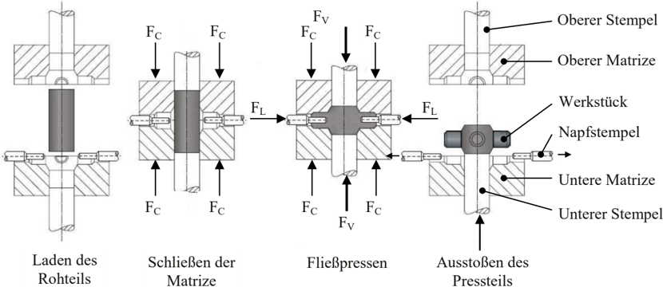
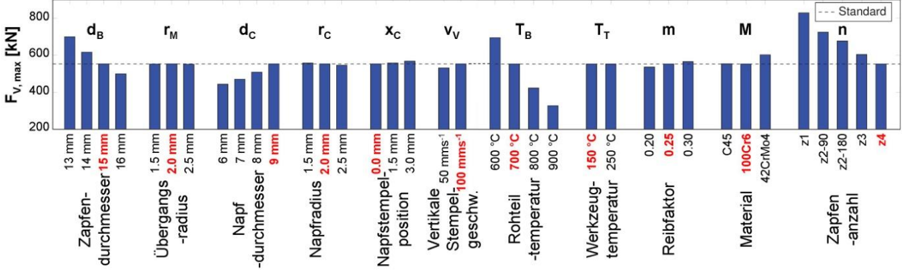
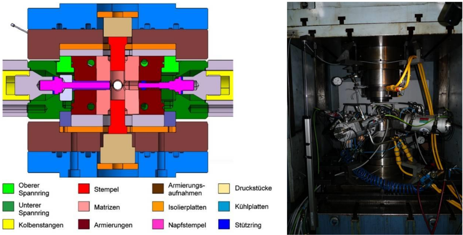
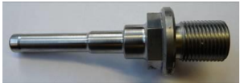
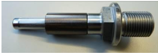
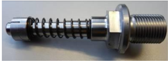
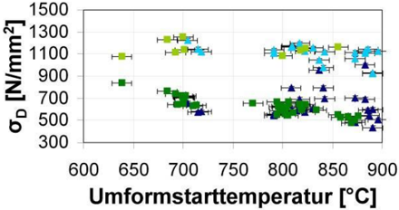

## Abgeschlossenes Projekt

Projekttitel:

Kombiniertes Halbwarm-Hohl-Querfließpressen von hochfesten Stählen

Starttermin:

01.04.2009

Endtermin:

10.03.2012

Institut/Firma:

Institut für Umformtechnik (IFU), Universität Stuttgart

Leiter:

Prof. Dr.-Ing. Mathias Liewald MBA

Telefon:

+49 (0) 711 / 6 85 - 8 38 40

Fax:

+49 (0) 711 / 6 85 - 8-38 39

E-Mail:

mathias.liewald@ifu.uni-stuttgart.de

Bearbeiter:

Herr Christian Mletzko, Herr Matthias Braun

Ansprechpartner:

Projektnummer:

DFG LI 1556-8-1

## Ziele/Ergebnisse:

Stand: 08.02.2013

## 1. Entwicklung von Verfahrensgrundlagen bzw. Richtlinien für Prozessgestaltung und Werkzeugauslegung für das Halbwarm-Napf-Querfließpressen von hochfesten Stählen

Unter den Bedingungen des heutigen internationalen Wettbewerbes sind die Unternehmen der Umformtechnik gezwungen, geometrisch komplexe Bauteile aus schwierig umformbaren Werkstoffen zu entwickeln und zu fertigen. Das Verfahren des Quer-Fließpressens ermöglicht die umformtechnische Fertigung von Bauteilen, deren Form durch andere Fließpressverfahren nicht darstellbar ist. Das NapfQuer-Fließpressen, siehe Bild 1, von kreuzförmigen Bauteilen mit hohlen Zapfen, insbesondere aus höherfesten Stählen, stößt auf seine Grenzen hinsichtlich des Formänderungsvermögens bei Raumtemperatur  des  umzuformenden  Werkstoffes  und  der  aus  den  Prozessbedingungen  resultierenden Werkzeugbeanspruchung.

Bild 1: Schematischer Verfahrensablauf des Napf-Quer-Fließpressens

*The diagram shows three different types of metal forming processes: 
- **Laden des Rohteils** (Loading of the die): This is a process where the workpiece is loaded into the die.
- **Schließen der Matrize** (Closing the matrix): This is a process where the matrix is closed around the workpiece.
- **Fließen der Matrize** (Unloading of the matrix): This is a process where the matrix is opened and the workpiece is removed.*

Eine Möglichkeit zur Erweiterung der oben genannten Verfahrensgrenzen bietet die Halbwarmumformung im  Bereich  von  600 °C  bis  900 °C.  Eine  Erhöhung  des  Formänderungsvermögens  bei  Halbwarmtemperaturen soll die Verfahrensgrenzen hinsichtlich der Gestaltung von geometrischen Formen wesentlich  erweitern.  Durch  eine  temperaturbedingte  Herabsetzung  der  Fließspannung  ist  mit  einer signifikanten Reduzierung des in den aktiven Werkzeugteilen herrschenden Druckspannungszustan-

*The image depicts a diagram illustrating a metal forming process, specifically a press brake operation. The press brake is a machine used in metal forming to shape and bend metal sheets, plates, or bars into desired shapes. The process involves a series of steps:

1. **Preparation**: The first step is the preparation of the metal workpiece. This includes loading the metal material into the press brake, ensuring it is securely held in place. The material is typically held in a clamping mechanism that holds it in place.

2. **Bending**: The press brake then uses a series of hydraulic or pneumatic mechanisms to bend the metal workpiece. The bending mechanism is controlled by a series of levers and pulleys, which are used to adjust the angle and depth*

des zu rechnen. Zusätzliche positive Effekte der Kraft- bzw. Spannungsreduktion und der verbesserten Formfüllung könnten durch das Auslösen eines geteilten Stoffflusses in der Verfahrenskombination des Hohl-Querfließpressens mit einem doppelseitigen Napf-Rückwärtsfließpressen auftreten.

Eine Analyse des Standes der Technik bestätigt, dass die Verfahrensgrundlagen zum Halbwarm-NapfQuerfließpressen von kreuzförmigen Bauteilen mit Leichtbaupotential nur für Einzelfälle bekannt sind. Zentrales Ziel des Forschungsvorhabens bildet daher die Entwicklung von Verfahrensgrundlagen bzw. Richtlinien  für  Prozessgestaltung  und Werkzeugauslegung für das Halbwarm-Napf-Querfließpressen von hochfesten Stählen zur Erschließung neuer Bauteilfamilien für kreuzartige Werkstücke. Wichtigstes Teilziel stellt dabei die Bestimmung der Prozesskräfte und Spannungen im Umformwerkzeug verbunden mit der Bestimmung von Verfahrensgrenzen dar. Folgende Versuchsparameter sollen dabei variiert werden: Werkstückwerkstoffe, Rohteil- und Werkzeugtemperatur, Zapfenanzahl und geometrische Verhältnisse, Position der Stirnflächen von Zapfenstempeln in Relation zum Rohteil, Rohteil- und Zapfenlänge, Schmierstoffsysteme.

## Wie kann ein Unternehmen die Projektergebnisse zu diesem Ziel in die Praxis umsetzen?

Die  simulativ  erworbenen  Erkenntnisse  zum  Halbwarm-Napf-Quer-Fließpressen  bilden  eine  erste Grundlage für die Verfahrens- und Werkzeugentwicklung in der industriellen Praxis, insbesondere in Hinblick  auf  die  oftmals  kritische  thermo-mechanische  Werkzeugbelastung.  Aus  den  Experimenten geht  hervor,  dass  der  Führung  der  lateralen  Napfstempel  besondere  Bedeutung  geschenkt  werden muss, worin auch weiterer Forschungsbedarf gesehen werden kann. Eine wichtige zukünftige Aufgabe besteht  in  der  Verbesserung  der  mechanischen  Eigenschaften  von  Warmarbeitsstählen  oder  die Entwicklung  neuer  Werkstoffkonzepte,  um  auch  bei  hohen  Prozesstemperaturen  den  auftretenden Spannungen standzuhalten. Auf dieser Basis können kreuzförmige Bauteilfamilien mit hohlen Zapfen aus höherfesten Stahlwerkstoffen erschlossen werden, deren Vorteil während ihrer Produktion in der besseres  Materialausnutzung  liegt,  verglichen  mit  der  Fertigung  in  Prozessketten  mit  spanender Fertigung.

## Womit kann ein Unternehmen dieses Ziel erreichen?

Nach Recherche und Bewertung der internationalen Fach- und Patentliteratur wurden zur Auslegung des Versuchswerkzeuges und zur Verringerung des Aufwands an realen Versuchen mit der Software Deform 3D eine Untersuchung des Halbwarm-Napf-Quer-Fließpressens mithilfe  der Finite Elemente Methode durchgeführt. Die Planung der durchgeführten Simulationen und deren Auswertung erfolgte nach Grundsätzen der statistischen Versuchsplanung.

Die Konstruktion des Werkzeuges erfolgte nach methodischen Grundsätzen. Aus einer Funktionsanalyse  ergaben sich neben  dem Quer-Fließpressen weitere Hauptfunktionen für das Werkzeug: Napfstempel horizontal bewegen, Napfstempel in Position halten, Aktivteile des Werkzeugs erwärmen.

Ebenfalls nach Grundsätzen der statistischen Versuchsplanung wurden experimentelle Untersuchungen zum Halbwarm-Napf-Quer-Fließpressen, Halbwarm-Voll-Quer-Fließpressen und zur Verfahrensfolge  aus  Halbwarm-Voll-Quer-Fließpressen  und  unmittelbar  angeschlossenem  Napf-RückwärtsFließpressen zur Erzeugung hohler Zapfen durchgeführt. Die Auswertung erfolgte hinsichtlich der benötigten Umformkräfte sowie Gebrauchseigenschaften der Werkstücke (Gefüge, Härte, Festigkeit).

## FE-Prozesssimulation des Halbwarm-Napf-Quer-Fließpressens

Im Rahmen der FEM-Parameterstudien wurden für die Stahlwerkstoffe 100Cr6 (Anlieferungszustand "GKZ") sowie C45 und 42CrMo4 (Anlieferungszustand "kaltscherbar") starr-real verfestigende Fließkurven  verwendet.  Zur  Charakterisierung  des  Materialverhaltens  wurden  Stauchversuche  mit  drei Stahlwerkstoffen mit dem Plastometer des Instituts für Umformtechnik durchgeführt. Als Umformstarttemperaturen wurden 600 °C, 700 °C, und 800 °C gewählt, als Umformgeschwindigkeiten 0,2 s -1 , 1 s -1 und 10 s -1 .  Das Hauptaugenmerk lag auf der Ermittlung geometrischer (Zapfenanzahl, Zapfendurchmesser, Napfdurchmesser, Napfradius, Napfstempelposition, Übergangsradius zwischen Werkstückhauptkörper  und  Zapfen)  und  prozessspezifischer  (Reibfaktor,  Werkstückwerkstoff,  Rohteil-  und Werkzeugtemperatur, Geschwindigkeit der vertikalen Presstempel) Faktoren, welche einen besonders großen Effekt auf die benötige Umformkraft der vertikalen Stempel haben.

Für die Simulation mit den Standardeinstellungen für alle Faktoren (jeweilige Standardeinstellung in Bild 2 rot) ergibt sich ein analog zum Voll-Quer-Fließpressen erwarteter Verlauf der Pressstempelkraft über dem Umformweg mit einer maximalen Presskraft von FV, max = 554 kN. In Bild 2 sind die in einem ersten Versuchsplan ermittelten Maximalkräfte in einem Effektendiagramm dargestellt. Es konnten die folgenden  Hauptfaktoren  identifiziert  werden:  Zapfendurchmesser dB,  Napfdurchmesser dC,  Rohteiltemperatur TB,  Material M  und  Zapfenanzahl n.  Mit  den  Ergebnissen  aus  dem  ersten  Versuchsplan und den Ergebnissen aus einem zweiten D-optimalen Versuchsplan wurden mithilfe des Verfahrens der multiplen Regression Formeln zur Berechnung der vertikalen Stempelkraft und der Napfstempelkraft ermittelt. Die maximale Abweichung zwischen Formel und Simulation beträgt 7 % bzw. 47 kN für die  vertikale  Stempelkraft und 17 % bzw. 10 kN für die Napfstempelkraft. Die lateralen Napfstempel stellen die am höchsten beanspruchten Werkzeugteile dar.

Bild 2: Effektendiagramm für die maximale vertikale Stempelkraft (jeweilige Standardeinstellung rot)

*This is a bar graph. The x-axis measures temperature in degrees Celsius. The y-axis measures force in kN. The graph shows the relationship between force and temperature. The force increases as the temperature increases.*

## Werkzeugauslegung, Versuchsaufbau und Versuchsablauf

Für die experimentellen Untersuchungen stand lediglich eine einfachwirkende hydraulische Presse zur Verfügung. Zur Durchführung eines zweiseitigen Quer-Fließpressen musste demnach eine Schließvorrichtung  verwendet werden, hier eine hydraulische Schließvorrichtung mit Stickstoffblasenspeichern. Bild 3 und Bild 4 zeigen den prinzipiellen Aufbau und das in die Versuchspresse eingebaute Versuchswerkzeug.

Bild 3: Prinzipieller Werkzeugaufbau

*The diagram shows a metal forming machine with different colored lines and shapes.*

Bild 4:  Eingebautes Werkzeug

Das Werkzeug besteht aus einer oberen und unteren armierten Matrize mit kreuzförmigen Gravuren. Ein  oberer  und  unterer  vertikaler  Stempel  werden  in  der  jeweiligen  Matrize  geführt.  Bei  der  Suche nach Wirkprinzipien  zur  translatorischen Bewegung der Napfstempel  wurde systematisch vorgegan-

gen und ein Ordnungschema erstellt. Nach Ermittlung der technischen Wertigkeit wurde die Umsetzung der Napfstempelbewegungen mittels Hydraulikzylinder als prinzipielle Lösung bestimmt, ein zusätzliches Hydraulikaggregat und eine SPS waren hierfür notwendig. Die Verwendung von Hydraulikzylindern zur Bewegung der Napfstempel hat zur Folge, dass keine gesonderte Lösung für das Halten der Napfstempelpositionen gefunden werden muss. Die Hydraulikzylinder können an jeder Stelle die notwendige Kraft aufbringen, um die Napfstempel auf ihrer Position zu halten. Da für jeden Zylinder ein eigenes Servo-Ventil verwendet wird, kann über die SPS für jeden Zylindern einzeln dessen Sollposition unabhängig von den Positionen der weiteren Zylinder vorgegeben werden. Weiterhin kann die Maximalkraft begrenzt werden, bei Erreichen eines Schwellwertes auf Kraftregelung geschalten werden oder bei Verwendung eines kraftgeregelten Modi die Position begrenzt werden bzw. bei Erreichen eines  Schwellwertes  auf  Positionsregelung  geschalten  werden,  jeweils  wiederum  separat  für  jeden einzelnen Zylinder. Zur Variation geometrischer Einflussfaktoren erfolgte der Werkzeugaufbau modular. Durch auswechselbare Matrizeneinsätze und Napfstempel sowie verschließbare Zapfenausflusskanäle können Werkstücke mit einem, zwei, drei oder vier napfförmigen Zapfen mit Außendurchmesser  15 mm  und  Innendurchmesser  9 mm  bzw.  Außendurchmesser  13 mm  und  Innendurchmesser 7 mm hergestellt werden.

Eine  sich  stationär  einstellende  Temperatur  der  Aktivteile  während  des  Umformprozesses  kann  mit dem Versuchswerkzeug ebenfalls nachgebildet  werden. In beiden  Matrizenarmierungen sind je vier Bohrungen angebracht, die der Aufnahme von Heizpatronen dienen. Mittels Thermoelemente erfolgt die  Messung  zur  Regelung  der Werkzeugtemperatur.  Zur  thermischen  Entkopplung  der  Schließvorrichtung dienen Isolierplatten zwischen den Matrizen und Matrizenaufnahmen sowie unter bzw. über den Stempel-Druckstücken. Darüber hinaus werden die Matrizenaufnahmen mit Wasser gekühlt. Die vier Hydraulikzylinder werden im Bereich der Anbindung der Napfstempel durch Druckluft gekühlt.

Die  Erwärmung  der  Rohteile  (Höhe 50 mm,  Durchmesser 24,6 mm,  gestrahlt,  im  Tauchbad  vorbeschichtet mit der wässrigen Graphit-Dispersion Berulit 935 H der Fa. Carl Bechem GmbH, Verhältnis Dispersion zu Wasser 1:2,5) erfolgte mithilfe einer Induktionsanlage auf Temperaturen, so dass 20 s nach Beendigung der Erwärmung Temperaturen von 700 °C, 800 °C und 900 °C in den Rohteilkernen erreicht  wurden.  Beide  Matrizen  wurden  auf  125 °C  vorgewärmt;  als  Gesenkschmierstoff  wurde Beruforge  393 G  (Fa.  Carl  Bechem  GmbH,  Verhältnis  Konzentration  zu  Wasser  1:4)  mittels  einer Sprühpistole vor jedem Hub auf alle Aktivteile aufgetragen.

## Experimentelle Untersuchungen zum Halbwarm-Quer-Fließpressen

## Versuche zum Halbwarm-Napf-Quer-Fließpressen

Die Abschätzung der auftretenden Spannungen der lateralen Napfstempel (kritischste Werkzeugteile) durch Anwendung der simulativ ermittelten analytischen Formeln führte zu einer starken Eingrenzung des Versuchsplans: Höhere Umformtemperaturen führen zwar zu einer Absenkung der mechanischen Spannungen, die thermische Belastung des Werkzeuges nimmt aber zu.

Zunächst sollten Versuche mit der Matrize mit Zapfendurchmesser 15 mm und Stempeln des Durchmessers 9 mm durchgeführt werden. Begonnen wurden die Versuche bei der für die lateralen Napfstempel niedrigsten zu erwartenden mechanischen Belastung (C45, 900 °C, 4 Zapfen); diese lag jedoch  lediglich  geringfügig  unter  der  maximalen  ertragbaren  Druckspannung.  Die  lateralen  Umformstempel berührten dabei das Rohteil unmittelbar vor Beginn des Quer-Fließpressvorgangs. Bei Verwendung von Stempeln nach Bild 5 a) mit einem kurzen Bund zur Führung jedes einzelnen Stempels im während des Umformvorgangs geschlossenen Matrizenverbund versagten die Stempel aufgrund der auftretenden Biegebelastung. Die Biegebelastung war so hoch, dass es in den Zapfen teilweise zur  Materialtrennung  kam und  Löcher  in  den  Napfwänden  der  Zapfen  entstanden.  Die  Stempel mit 7 mm Durchmesser bei Verwendung der Matrizen mit Ausflussdurchmessern von 13 mm versagten analog.

- a) Kurzer Führungsbund
- c) Verlängerter Führungsbund
- b) Führung über Hülse

*The image shows a metal forming technology diagram. The diagram depicts a cylindrical metal rod with a threaded end and a flange at the other end. The rod is threaded to allow for easy attachment and removal of the rod to and from the forming tool. The flange at the end of the rod is likely used to provide additional support and stability to the rod during the forming process.*

*The image depicts a metal forming technology component, specifically a bearing assembly. The bearing assembly consists of a cylindrical body with a smooth surface and a threaded end. The cylindrical body is likely made of a high-strength metal, such as steel or titanium, due to its durability and resistance to wear. The threaded end is likely used for attaching the bearing assembly to a shaft or other component.

The bearing assembly is mounted on a surface, likely a metal plate or a metal frame, which is visible at the bottom of the image. The plate or frame is likely used to support the assembly and ensure it is securely in place.

The bearing assembly is designed to reduce friction and allow smooth rotation of a shaft or other component. The threads on*

Bild 5: Im Laufe des Projekts verwendete Führungen der lateralen Napfstempel

*The image depicts a metal forming technology component, specifically a part of a mechanical assembly. The object is a long, cylindrical metal piece with a threaded end and a hexagonal nut at the opposite end. The nut is attached to a larger, cylindrical piece that has a spring-loaded mechanism. The spring is wound around the cylindrical body and secured by a metal clip. The clip is attached to the threaded end of the cylindrical piece.

The cylindrical body has a smooth, polished surface, indicating that it is likely made of a high-strength metal, such as steel or aluminum. The threads at the end of the cylinder are likely used for attaching the component to a threaded surface, such as a bolt or a stud. The hexagonal nut at the other*

Zur verbesserten Führung der lateralen Napfstempel wurde ein Konzept entwickelt, dass je Stempel eine zweiteilige, auf je einer Feder gegen die Stempel abgestützte Hülse vorsieht, siehe Bild 5b). Das Konzept stellte sich jedoch selbst für Versuchszwecke als nicht montierbar dar und konnte nicht erprobt werden. Auf bereits vorhandene Stempel wurden anschließend Hülsen für eine verlängerte Führung  aufgeschrumpft  bzw.  wurden  neue  Stempel  mit  verlängerten  Bunden  gefertigt,  siehe  Bild  5c). Durch die verlängerte Führung konnte die Biegung der Napfstempel zwar verringert, jedoch nicht zufriedenstellend  vermieden  werden.  Das  Biegen  der  Stempel  zu  Umformbeginn  einseitig  nach  oben oder unten führt zu einem ungleichmäßigen Gleichlauf der beiden Schließvorrichtungshälften und zu einem  ungleichmäßigen  Werkstofffluss.  Ein  Vergleich  zwischen  Experiment  und  Simulation  konnte nicht durchgeführt werden und somit auch keine Verifkation bzw. Verbesserung des Simulationsmodells sowie der analytischen Formeln zur Stempelkraftberechnung.

## Versuche zum Halbwarm-Voll-Quer-Fließpressen

Zur Untersuchung des Einflusses von Werkstoff (100Cr6, C45, 42CrMo4) und Umformstarttemperatur (zwischen 638 °C und 896 °C) auf Umformkraft und Gebrauchseigenschaften der gefertigten Werkstücke wurden Versuche zum Voll-Quer-Fließpressen von Werkstücken mit vier Zapfen mit Durchmesser 13 mm und von einem bis vier Zapfen mit Durchmesser 15 mm durchgeführt. Die Ergebnisse zu den maximalen Umformkräften entsprechen der Erwartung: je geringer die Zapfendurchmesser, je geringer die Zapfenanzahl und je geringer die Umformtemperatur desto höher die Kräfte, mit Ausnahme von ähnlich niedrigen Kräften bei der Umformung von 100Cr6 im Bereich um 700 °C, verglichen mit Umformkräften bei höheren Umformtemperaturen.

Es wurden an Proben mit Zapfendurchmesser 13 mm (nach der Umformung entweder an Luft oder in Wasser abgekühlt) im Bereich der Zapfen bzw. im Probenhauptkörper Mikrohärtemessungen durchgeführt. Weiterhin wurden aus den Zapfen Stauchproben entnommen, um eine repräsentative Druckfestigkeit bei einem Umformgrad von φ = 0,05 zu ermitteln. Für den Werkstoff C45 und Abkühlung der Proben an Luft gilt: je höher die Umformtemperatur, desto geringer die Steigerung der Härte gegenüber  dem  Ausgangszustand in Folge  von Werkstoffverfestigung  und  thermischen  Einflüssen.  Durch Abschrecken an Wasser kann die Härte nach Umformung bei ca. 700 °C bzw. ca. 800 °C weiter gesteigert werden, in hohem Maße jedoch nach Umformung bei ca. 870 °C, siehe dazu auch Tabelle 1.

Gleiches gilt analog für die ermittelte Druckfestigkeit, siehe Tabelle 2.

Tabelle 1: Vickershärte HV0,1, ermittelt in verschiedenen Werkstückbereichen an Werkstücken aus unterschiedlichen Werkstoffen mit Zapfendurchmesser 13 mm, umgeformt bei Temperaturen zwischen 684 °C und 873 °C, abgekühlt an Luft oder in Wasser

| C45                      | C45                      | C45                      | 42CrMo4        | 42CrMo4        | 42CrMo4    | 42CrMo4   | 100Cr6              | 100Cr6              | 100Cr6     | 100Cr6   |
|--------------------------|--------------------------|--------------------------|----------------|----------------|------------|-----------|---------------------|---------------------|------------|----------|
| Ausgangshärte: 241 HV0,1 | Ausgangshärte: 241 HV0,1 | Ausgangshärte: 241 HV0,1 | Ausgangshärte: | Ausgangshärte: | Wasser     | Wasser    | Ausgangshärte: Luft | Ausgangshärte: Luft | Wasser     | Wasser   |
| Zapfen Mitte             | Zapfen                   |                          | Mitte          | Zapfen Mitte   | Zapfen     | Mitte     | Zapfen              | Mitte               | Zapfen     | Mitte    |
| 287                      | 288                      | 311                      | 281            | 305 278        | 315        | 298       | 296                 | 279                 | 289        | 275      |
| (T B = 684 °C)           | (T B =                   | 700                      | °C)            | = 701 °C)      | (T B = 700 | °C)       | (T B =              | 710 °C)             | (T B =     | 700 °C)  |
| 245                      | 295 286                  |                          | 307            | 352 393        | 627        | 745       | 275                 | 296                 | 284        | 341      |
| (T B = 803 °C)           | (T B                     | = 794                    | °C)            | = 804 °C)      | (T B = 799 | °C)       | (T B =              | 806 °C)             | (T B = 806 | °C)      |
| 252                      | 285 537                  |                          | 457            | 436 485        | 751        | 867       | 343                 | 417                 | 535        | 550      |
| (T B = 869 °C)           | (T B                     | = 873                    | °C)            | = 856 °C)      | (T B = 866 | °C)       | (T B =              | 817 °C)             | (T B =     | 820 °C)  |

Tabelle 2: Druckfestigkeit bei einem Umformgrad σ = 0,05, ermittelt an Stauchproben, entnommen aus Zapfen mit Durchmesser 13 mm von Werkstücken aus unterschiedlichen Werkstoffen, umgeformt bei Temperaturen zwischen 684 °C und 873 °C, abgekühlt an Luft oder in Wasser

| C45 2                    | C45 2           | 42CrMo4 2                | 42CrMo4 2       | 100Cr6 Ausgangsfestigkeit: 632 N/mm 2   | 100Cr6 Ausgangsfestigkeit: 632 N/mm 2   |
|--------------------------|-----------------|--------------------------|-----------------|-----------------------------------------|-----------------------------------------|
| Ausgangsfestigkeit: Luft | 682 N/mm Wasser | Ausgangsfestigkeit: Luft | 771 N/mm Wasser | Luft                                    | Wasser                                  |
| 858 N/mm 2               | 832 N/mm 2      | 791 N/mm 2               | 836 N/mm 2      | 739 N/mm 2                              | 744 N/mm 2                              |
| (T B = 684 °C)           | (T B = 700 °C)  | (T B = 701 °C)           | (T B = 700 °C)  | (T B = 710 °C)                          | (T B = 700 °C)                          |
| 708 N/mm 2               | 837 N/mm 2      | 1008 N/mm 2              | 1747 N/mm 2     | 815 N/mm 2                              | 848 N/mm 2                              |
| (T B = 803 °C)           | (T B = 794 °C)  | (T B = 804 °C)           | (T B = 799 °C)  | (T B = 806 °C)                          | (T B = 806 °C)                          |
| 689 N/mm 2               | 1697 N/mm 2     | 1277 N/mm 2              | 2637 N/mm 2     | 1119 N/mm 2                             | 1423 N/mm 2                             |
| (T B = 869 °C)           | (T B = 873 °C)  | (T B = 856 °C)           | (T B = 866 °C)  | (T B = 817 °C)                          | (T B = 820 °C)                          |

Für 42CrMo4 konnte beobachtet werden, dass Härte und Druckfestigkeit gegenüber den Ausgangswerten gesteigert werden können, unabhängig ob an Luft oder in Wasser abgekühlt wurde. Die Erhöhung dieser beiden Eigenschaften geht mit der Erhöhung der  Umformtemperatur einher und ist bei Abkühlung an Wasser größer als bei Abkühlung an Luft. Bei an bei 866 °C umgeformten und in Wasser abgekühlten Werkstücken konnte eine Erhöhung der Druckfestigkeit auf bis ca. 2.600 N/mm 2 festgestellt werden.

Für 100Cr6 konnte die Steigerung der Härte durch Erhöhung der Umformtemperatur nur festgestellt werden, sofern die Probe zuvor auf Temperaturen größer 900 °C erwärmt wurde (auch falls die Umformung letztendlich bei Temperaturen um 820 °C stattfand). Im Gegensatz zur Härte konnte jedoch eine Steigerung der Druckfestigkeit durch Erhöhung der Umformtemperatur bereits ab ca. 800 °C festgestellt werden.

## Versuche  zur  Verfahrensfolge  aus  Halbwarm-Voll-Quer-Fließpressen  und  unmittelbar  angeschlossenem Napf-Rückwärts-Fließpressen zur Erzeugung hohler Zapfen

Durch  eine  Kombination  aus  Halbwarm-Voll-Quer-Fließpressen  und  unmittelbar  angeschlossenem Napf-Rückwärts-Fließpressen  konnten  zumindest  eingeschränkt  Werkstücke  mit  teilweise  hohl  ausgeführten  Zapfen  umformtechnisch  hergestellt  werden:  Nach  Erreichen  des  unteren  Totpunkt  der Presse verweilt diese vor der Umkehr zunächst dort und erst dann führen die Napfstempel eine weggesteuerte Umformbewegung aus.

Zum Schutz der Napfstempel vor einer zu großen thermo-mechanischen Belastung wurde bei Versuchen mit Matrizendurchmesser 13 mm und Zapfendurchmesser 7 mm die Kraft auf 45 kN begrenzt, bei Versuchen mit Matrizendurchmesser 15 mm und Zapfendurchmesser 9 mm auf 70 kN. Bei ersterer Kombination konnte die gewünschte Napftiefe in Form eines vorgegebenen Sollwerts in keinem Fall erreicht werden, bei zweiterer Kombination teilweise hingegen schon, je nach verwendetem Werkstoff, Zapfenanzahl und Umformtemperatur. Durch die Verringerung des Ausflussquerschnitts bei Werkstücken  mit  weniger  als  vier  Zapfen  steigt  beim  Voll-Quer-Fließpressen  aufgrund  mehr  dissipierter Wärme (es wird mehr Kraft benötigt) die Temperatur in den Zapfen, so dass beim Napf-RückwärtsFließpressprozess  eine  geringere  Spannung  zur  Einleitung  und  Aufrechterhaltung  von  Fließen  notwendig ist.

## Verfahrensgrenzen und Richtlinien für Prozessgestaltung

Begrenzt werden die drei untersuchten Verfahren durch die in den vertikalen (Gl. 1) sowie lateralen (Gl. 2)  Stempeln  auftretenden  Druckspannungen,  deren  Maxima  kleiner  bzw.  gleich  der  zulässigen Spannungen  der  verwendeten  Werkzeugwerkstoffe  sein  müssen.  Entscheidend  schwieriger  ist  die Bestimmung  der  zulässigen  Druckspannungen,  da  diese  temperaturabhängig  sind  und  in  hohem Maße von der Prozessführung (geometrische Faktoren, Werkstoff, Temperatur, Taktzeiten, Schmierung, Kühlung etc.) abhängen. Eine allgemeine Formulierung ist nicht möglich: Denen im Rahmen der Untersuchungen aufgetretenen maximalen Spannungen (in Abhängigkeit der Umformstarttemperatur dargestellt in Bild 6) beim Halbwarm-Voll-Quer-Fließpressen (Zapfendurchmesser 13 mm und 15 mm, 1-4  Zapfen)  und  Napf-Rückwärts-Fließpressen  von  unmittelbar  zuvor  durch  Halbwarm-Voll-Quer-

Fließpressen  hergestellten  Zapfen  (Napfdurchmesser  7 mm  bei  Zapfendurchmesser  13 mm,  Napfdurchmesser 9 mm bei Zapfendurchmesser 15 mm, 1-4 Zapfen) hielten die vertikalen Stempel stand, ebenso wie die lateralen Stempel (1.2367, 54-56 HRC). Die maximal zu erwartenden Kräfte FV,max und FL,max können durch die im Rahmen der simulativen Untersuchungen entwickelten Formeln berechnet werden, zur Werkzeugauslegung empfiehlt es sich zunächst einen Sicherheitsfaktor SF = 1,2 in die Berechnung mit einzubeziehen. Eine Exzentrizität zwischen Napfstempel und Zapfen sollte durch eine möglichst lange und genaue Stempelführung minimiert werden, durch Gl. (3) kann eine evtl. doch auftretende Exzentrizität bei der Berechnung der maximal zulässigen Prozesskräfte berücksichtigt werden. Weiterhin ist für die lateralen Napfstempel die theoretisch und empirisch ermittelte Knickgrenze aus der VDI-Richtlinie Nr. 3186 Blatt 2 zu beachten.

Als für die Prozessführung wichtigsten Punkte gelten:

-  Sicherstellung eines möglichst kurzeitigen Werkstück-Werkzeug-Kontakts,
-  Auftrag eines Gesenkschmierstoffs, auch zur Kühlung der Werkzeuge, nach jedem Hub,
-  Umformung jedoch nach Möglichkeit im oberen Temperaturbereich der Halbwarmumformung, um bei noch zulässigen Spannungen in den Napfstempeln hohle Zapfen herstellen zu können,
-  gesteuerte  Abkühlung  bzw.  angeschlossene Wärmebehandlung  zur Einstellung  von Gefüge und  Festigkeit-  bzw.  Härte,  vor  allem  nach  Umformung  im  oberen  Temperaturbereich  der Halbwarmumformung.

*The figure shows the relationship between the uniaxial stress (σ) and the uniaxial strain (ε) for different materials. The x-axis shows the uniaxial strain (ε) in mm2, while the y-axis shows the uniaxial stress (σ) in N/mm2. The figure shows that the stress-strain relationship for the material is nonlinear, with the stress increasing with the strain. The stress-strain relationship for the material is also nonlinear, with the stress increasing with the strain. The stress-strain relationship for the material is also nonlinear, with the stress increasing with the strain. The stress-strain relationship for the material is also nonlinear, with the stress*

Maximale Kraft auf vertikale Stempel: (1)

<!-- formula-not-decoded -->

Maximale Kraft auf laterale Stempel: (2)

<!-- formula-not-decoded -->

<!-- formula-not-decoded -->

e: Exzentrizität Napfstempel zu Zapfen

Bild 6: Druckspannungen in den lateralen Napfstempeln beim Napf-Rückwärts-Fließpressen von unmittelbar zuvor durch Halbwarm-Voll-Quer-Fließpressen hergestellten Werkstücken

## Wer kann bei Fragestellungen / der Umsetzung zu diesem Ziel helfen?

Institut für Umformtechnik Universität Stuttgart Herr Christian Mletzko

Tel.:

0711-685-83849

Fax:

0711-685-83839

E-Mail:

christian.mletzko@ifu.uni-stuttgart.de